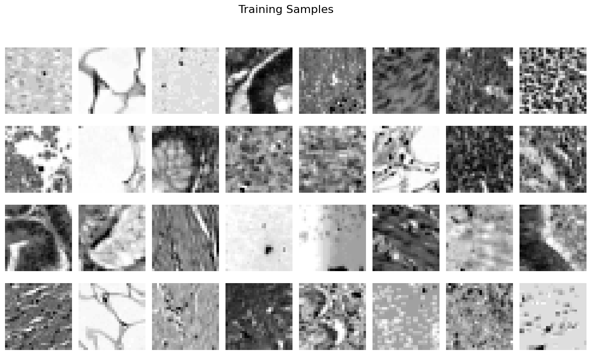
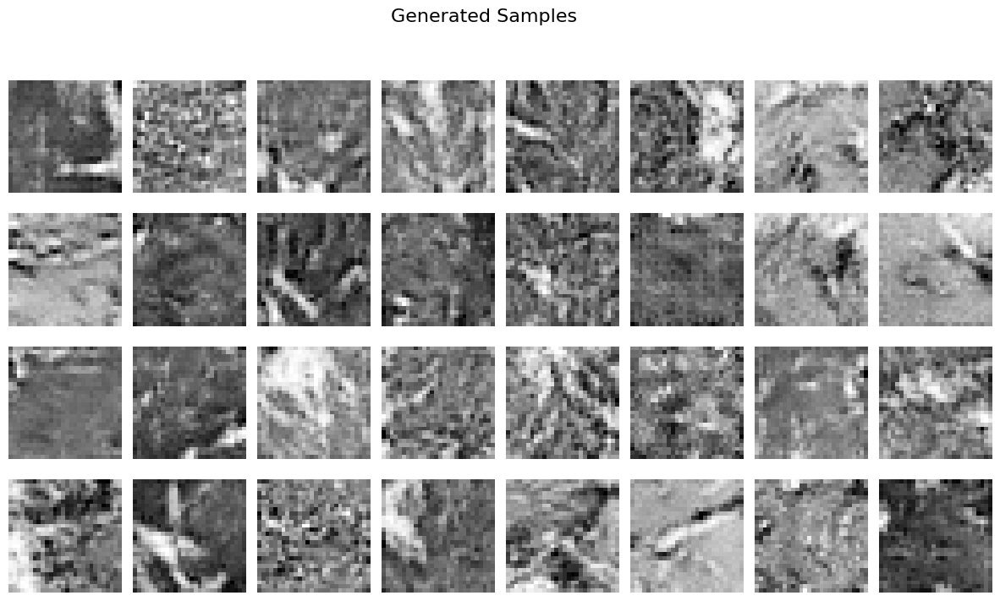
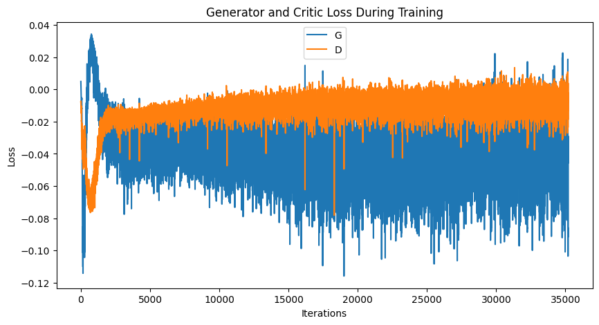
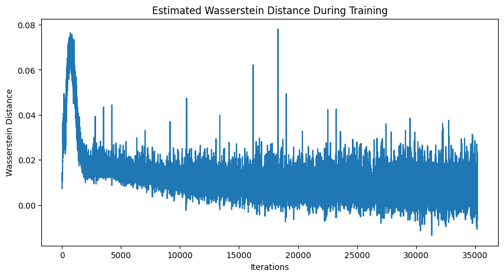

# WGAN Training on PathMNIST

This repository provides an implementation of a Wasserstein Generative Adversarial Network (WGAN) to generate synthetic images based on the PathMNIST dataset from MedMNIST. The training code, evaluation metrics (FID, Inception Score), and sample visualizations are included.

## Table of Contents
- [Overview](#overview)
- [Dependencies and Installation](#dependencies-and-installation)
- [Project Structure](#project-structure)
- [Training Details](#training-details)
- [Evaluation](#evaluation)
- [Results](#results)

## Overview
**Objective:** Train a Wasserstein GAN to generate grayscale pathology images similar to those in the PathMNIST dataset.

**Dataset:** The PathMNIST dataset is a collection of 28×28 histopathologic images.

**Model Architecture:**
- **Generator:** A fully-connected layer reshaped into feature maps, followed by transposed convolutions to upsample to 28×28 resolution.
- **Critic (Discriminator):** Convolutional layers that downsample the images and produce a scalar output (Wasserstein distance estimate).


*Example training samples from PathMNIST dataset*

## Dependencies and Installation
- Python 3.7 or above
- PyTorch 1.9 or above
- Torchvision 0.10 or above
- Numpy, Matplotlib, Pillow, tqdm, seaborn, scipy, scikit-learn (for various utilities and metrics)
- medmnist for loading the PathMNIST dataset

Install dependencies with:
```bash
pip install torch torchvision numpy matplotlib pillow tqdm seaborn scipy scikit-learn medmnist
```
## Project Structure
```
wgan-pathmnist/
├── data/                   # PathMNIST dataset storage
├── generated_images/       # Generated samples during training
│   └── generated_image.png # Example generated image
├── evaluation/             # Evaluation metrics and plots
│   ├── generator_critic_loss.png
│   ├── wasserstein_distance.png
│   └── pathmnist_wgan_metrics.json
├── models/                 # Saved generator/critic weights
├── wgan_train.py           # Main training script
└── utils.py                # Helper functions
```
## Training Details

### Data Preparation
PathMNIST images are processed with the following transformations:
- Converted to grayscale (1 channel)
- Normalized to mean=0.5, std=0.5

### Hyperparameters
| Parameter | Value | Description |
|-----------|-------|-------------|
| `batch_size` | 128 (GPU) / 64 (CPU) | Training batch size |
| `image_size` | 28 | Input image dimensions (28×28) |
| `nc` | 1 | Number of channels (grayscale) |
| `nz` | 100 | Latent space dimension |
| `ngf` | 64 | Generator feature maps |
| `ndf` | 64 | Critic feature maps |
| `num_epochs` | 50 | Total training epochs |
| `lr` | 0.00005 | Learning rate (RMSprop optimizer) |
| `n_critic` | 5 | Critic updates per generator update |
| `weight_clip` | 0.01 | Weight clipping constraint |

### Loss Function
Wasserstein loss formulation:
```math
L_{WGAN} = \mathbb{E}[Critic(x)] - \mathbb{E}[Critic(G(z))]
```
## Evaluation

### 1. Fréchet Inception Distance (FID)
  FID Score: 67.4243
  
### 2. Inception Score (IS)
  Inception Score: 1.0689 ± 0.0058

### 3. Visual Inspection
  
*4×4 grid showing progressive improvement across training epochs (left→right, top→bottom)*

- **Required Image Files**:
  - `generated_images/epoch_comparison.png`: Should contain:
    - 16 sample images
    - Clear epoch labels
    - Visible quality progression

## Results

### Training Metrics
  
*Dual-axis plot showing generator (blue) and critic (orange) loss trajectories*

- **Image Contents**:
  - X-axis: Training epochs
  - Left Y-axis: Generator loss scale
  - Right Y-axis: Critic loss scale
  - Vertical lines marking critic update steps

### Wasserstein Distance
  
*Smoothed curve showing the critic's output difference between real/fake samples*

- **Image Contents**:
  - X-axis: Training iterations
  - Y-axis: Wasserstein distance value
  - Horizontal reference line at y=0
  - Highlighted clipping boundaries (±0.01)

### Sample Outputs
```text
generated_images/
├── epoch_10.png   # Early stage (blurry)
├── epoch_30.png   # Intermediate
└── epoch_final.png # Best results
